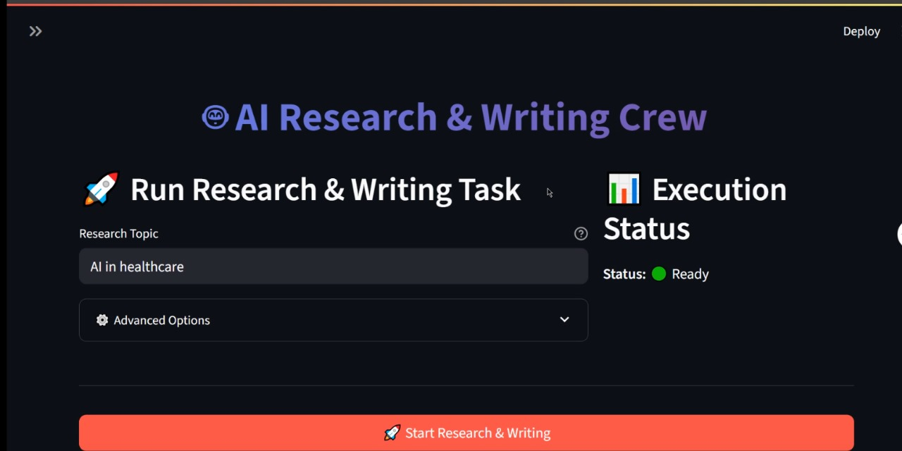

# 🤖 AI Research & Writing Crew

A powerful multi-agent AI system built with CrewAI, Streamlit, and Google Gemini that automatically researches topics and generates compelling articles. This application leverages the power of AI agents working collaboratively to produce high-quality content.

[](https://youtu.be/xX8Rcdwm2YE)


## 🌟 Features

- **Multi-Agent System**: Two specialized AI agents working in harmony
  - 🔬 **Senior Researcher**: Discovers groundbreaking technologies and trends
  - ✍️ **Writer**: Crafts engaging, accessible narratives
- **Interactive Web Interface**: Beautiful Streamlit-powered UI
- **Real-time Web Search**: Live research capabilities using Serper API
- **Google Gemini Integration**: Powered by Google's advanced language model
- **Automatic File Generation**: Saves articles as markdown files
- **Progress Tracking**: Real-time execution status and progress bars
- **Flexible Configuration**: Customizable settings and options

## 🏗️ Architecture

The application follows a modular architecture with clear separation of concerns:

```
AI Research & Writing Crew/
├── agents.py         
├── tasks.py          
├── tools.py       
├── crew.py          
├── app.py           
├── requirements.txt   
├── .env             
└── README.md      
```

### 🔧 Core Components

1. **Agents** (`agents.py`):
   - **Senior Researcher**: Specialized in uncovering breakthrough technologies
   - **Writer**: Expert in creating compelling, accessible tech narratives

2. **Tasks** (`tasks.py`):
   - **Research Task**: Comprehensive analysis of trends, pros/cons, and opportunities
   - **Writing Task**: Article composition with focus on engagement and clarity

3. **Tools** (`tools.py`):
   - **SerperDevTool**: Web search capabilities for real-time information gathering

4. **Crew Orchestration** (`crew.py`):
   - Sequential task execution
   - Agent coordination and communication

5. **Web Interface** (`app.py`):
   - User-friendly Streamlit application
   - Real-time progress tracking
   - File download capabilities

## 🚀 Quick Start

### Prerequisites

- Python 3.8 or higher
- Google API Key (Gemini)
- Serper API Key

### 1. Clone and Setup

```bash
# Clone the repository
git clone https://github.com/ahmedAmer8/Multi-Agent-Content-Generation-System.git
cd ai-research-writing-crew

# Create virtual environment
python -m venv venv

# Activate virtual environment
# On Windows:
venv\Scripts\activate
# On macOS/Linux:
source venv/bin/activate

# Install dependencies
pip install -r requirements.txt
```

### 2. Get API Keys

#### Google API Key (Gemini)
1. Visit [Google AI Studio](https://makersuite.google.com/app/apikey)
2. Sign in with your Google account
3. Create a new API key
4. Copy the generated key

#### Serper API Key
1. Visit [Serper.dev](https://serper.dev/)
2. Sign up for a free account
3. Navigate to your dashboard
4. Copy your API key

### 3. Configure Environment

Create a `.env` file in the project root:

```env
GOOGLE_API_KEY=your_google_api_key_here
SERPER_API_KEY=your_serper_api_key_here
```

### 4. Run the Application

#### Option 1: Web Interface (Recommended)
```bash
streamlit run app.py
```

#### Option 2: Command Line
```bash
python crew.py
```

## 📖 Usage Guide

### Web Interface

1. **Launch the App**: Run `streamlit run app.py`
2. **Configure API Keys**: 
   - Enter your API keys in the sidebar, OR
   - Set them in your `.env` file (recommended)
3. **Choose Research Topic**: Enter any topic you want to research
4. **Customize Settings**: Use advanced options if needed
5. **Start Research**: Click "Start Research & Writing"
6. **View Results**: Read the generated article and download if needed

### Command Line

1. **Edit Topic**: Modify the topic in `crew.py`
2. **Run**: Execute `python crew.py`
3. **View Output**: Check the console output and generated file

## 🛠️ Configuration Options

### Agent Configuration

**Senior Researcher Agent**:
- **Role**: Senior Researcher
- **Goal**: Uncover groundbreaking technologies
- **Tools**: Web search capabilities
- **Memory**: Enabled for context retention
- **Delegation**: Allowed

**Writer Agent**:
- **Role**: Writer
- **Goal**: Create compelling tech narratives
- **Tools**: Web search capabilities
- **Memory**: Enabled for context retention
- **Delegation**: Disabled

### Task Configuration

**Research Task**:
- **Output**: 3-paragraph comprehensive report
- **Focus**: Trends, pros/cons, market opportunities, risks
- **Tools**: Web search enabled

**Writing Task**:
- **Output**: 4-paragraph markdown article
- **Focus**: Latest trends and industry impact
- **File Output**: Automatically saved as `new-blog-post.md`

### Model Configuration

- **Model**: Google Gemini 1.5 Flash
- **Temperature**: 0.5 (balanced creativity/consistency)
- **Verbose Mode**: Enabled for detailed logging

## 📊 Output Examples

### Sample Research Output
```
# AI in Healthcare: Revolutionary Advances

## Current Landscape
The healthcare industry is experiencing unprecedented transformation through artificial intelligence...

## Key Opportunities
Machine learning algorithms are revolutionizing diagnostic accuracy, with AI systems now capable of...

## Potential Challenges
Despite promising developments, several challenges remain, including data privacy concerns...

## Future Outlook
The integration of AI in healthcare promises to reshape patient care fundamentally...
```

## 🔧 Customization

### Adding New Agents

```python
# In agents.py
new_agent = Agent(
    role="Your Role",
    goal="Your Goal",
    backstory="Agent backstory...",
    tools=[tool],
    llm=llm,
    verbose=True,
    memory=True
)
```

### Creating Custom Tasks

```python
# In tasks.py
custom_task = Task(
    description="Task description...",
    expected_output="Expected output format...",
    tools=[tool],
    agent=your_agent,
    output_file='output.md'
)
```

### Adding New Tools

```python
# In tools.py
from crewai_tools import YourTool
new_tool = YourTool(api_key="your_key")
```

## 🚨 Troubleshooting

### Common Issues

1. **API Key Errors**:
   - Verify keys are correctly set in `.env` or Streamlit sidebar
   - Check key validity on respective platforms
   - Ensure proper formatting (no extra spaces)

2. **Import Errors**:
   - Verify all files are in the same directory
   - Check Python environment activation
   - Reinstall dependencies: `pip install -r requirements.txt`

3. **Async Loop Errors**:
   - The app includes async loop handling
   - If issues persist, restart the Streamlit server

4. **Search Tool Errors**:
   - Verify Serper API key is valid
   - Check internet connection
   - Ensure API quota isn't exceeded

### Debug Mode

Enable verbose logging by setting `verbose=True` in agent configurations for detailed execution logs.

## 📦 Dependencies

### Core Libraries
- **crewai**: Multi-agent orchestration framework
- **streamlit**: Web application framework
- **langchain-google-genai**: Google Gemini integration
- **crewai-tools**: Additional tools for agents
- **python-dotenv**: Environment variable management

### Full Dependency List
See `requirements.txt` for complete list of dependencies with version specifications.

## 🔐 Security Considerations

- **API Keys**: Never commit API keys to version control
- **Environment Variables**: Use `.env` files for local development
- **Production**: Use secure environment variable management
- **Rate Limits**: Be mindful of API rate limits and quotas

## 🤝 Contributing

1. Fork the repository
2. Create a feature branch: `git checkout -b feature/amazing-feature`
3. Commit changes: `git commit -m 'Add amazing feature'`
4. Push to branch: `git push origin feature/amazing-feature`
5. Open a Pull Request

## 📄 License

This project is licensed under the MIT License - see the LICENSE file for details.

## 🙏 Acknowledgments

- **CrewAI Team**: For the amazing multi-agent framework
- **Google**: For the powerful Gemini language model
- **Serper**: For reliable web search capabilities
- **Streamlit**: For the intuitive web framework

## 📞 Support

For support, questions, or suggestions:
- Open an issue on GitHub
- Check the troubleshooting section
- Review CrewAI documentation

## 🚀 Future Enhancements

- [ ] Support for multiple LLM providers
- [ ] Custom agent templates
- [ ] Advanced scheduling capabilities
- [ ] Integration with more research tools
- [ ] Export to multiple formats (PDF, DOCX)
- [ ] Multi-language support
- [ ] Advanced analytics and reporting

---

Built with ❤️ using CrewAI, Streamlit, and Google Gemini
